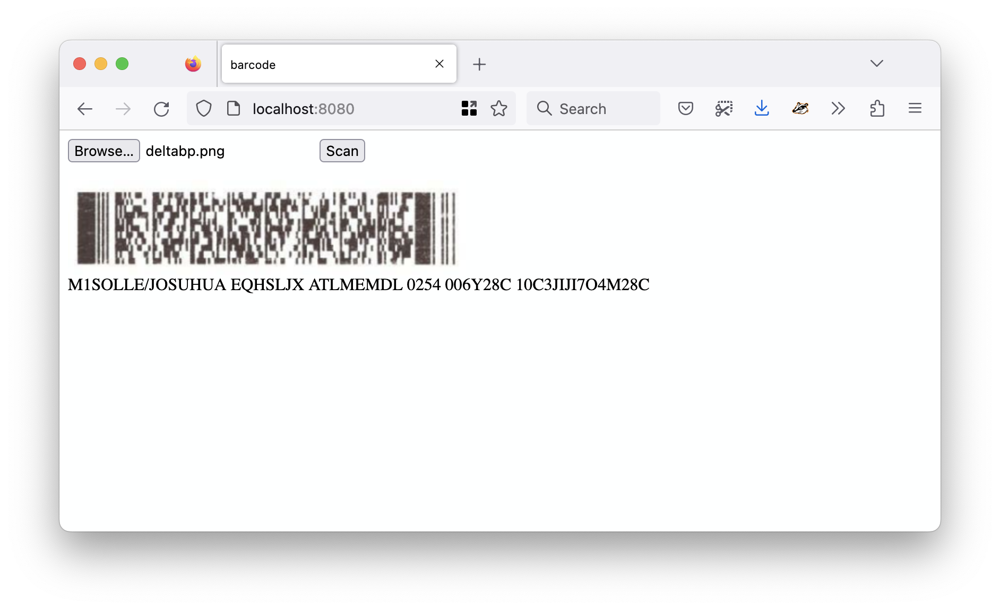

# rs-rxing-wasm

This is an exploratory web application to decode barcodes using the [rxing-core/rxing-wasm](https://github.com/rxing-core/rxing-wasm) WebAssembly binary.



## Building

```
git clone git@github.com:rxing-core/rxing-wasm.git /usr/local/src/rxing-wasm
cd /usr/local/src/rxing-wasm  

wasm-pack build --release --target web
wasm-opt pkg/rxing_wasm_bg.wasm -o pkg/rxing_wasm_bg-opt.wasm --enable-bulk-memory -O1 --inlining-optimizing --heap-store-optimization --optimize-casts -Oz -O4
mv pkg/rxing_wasm_bg-opt.wasm pkg/rxing_wasm_bg.wasm

cp pkg/rxing_wasm.js pkg/rxing_wasm_bg.wasm /usr/local/sfomuseum/rs-rxing-wasm/www/
```

## Testing

To test the build you can use any old HTTP fileserver that supports CORS and customized mime type headers (if necessary). I like to use the [aaronland/go-http-fileserver](https://github.com/aaronland/go-http-fileserver) package because I wrote it but anything will do. For example:

```
> make debug
fileserver -root ./www -mimetype js=text/javascript -mimetype wasm=application/wasm -enable-cors
2025/02/21 11:21:25 Serving ./www and listening for requests on http://localhost:8080
```

## See also

* https://github.com/rxing-core/rxing-wasm
* https://rustwasm.github.io/wasm-pack/book/commands/build.html